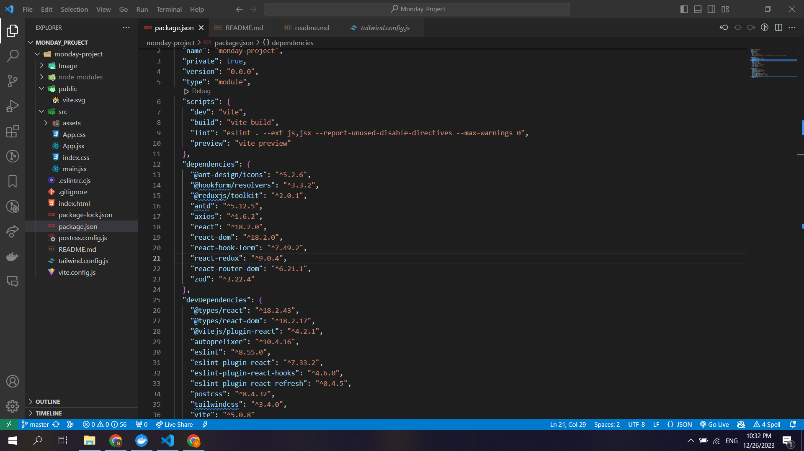

# MONDAY PROJECT

Hệ thống được thiết kế nhằm cung cấp một giải pháp quản lý dự án và công việc toàn diện, 
giúp các tổ chức và cá nhân theo dõi, quản lý, và tối ưu hóa quy trình làm việc của họ. 
Mục tiêu chính là tăng cường hiệu suất, rõ ràng thông tin và cải thiện giao tiếp trong
các nhóm làm việc.

## How to start
    git clone https://github.com/NamVNSE173138/Monday_Project.git .
    npm install
    npm run dev

## Used Lib
    antd: xử lí component UI
    axios: call api
    react-hook-form: xử lí form
    react-redux: xử lí dữ liệu phức tạp
    react-router-dom: xửa lí định tuyến giữa Single Page Application
    zod: xử lí validation

    
